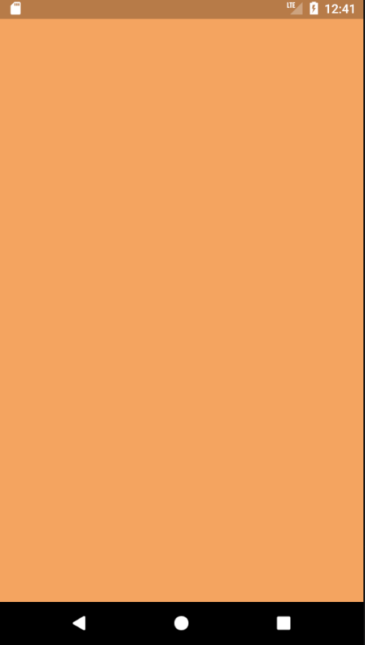
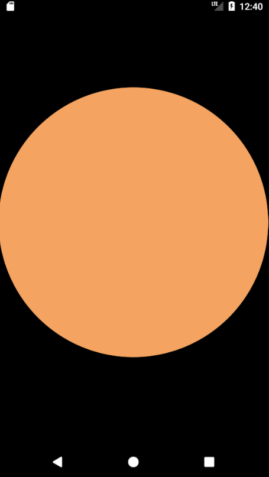

# BoxDecoration

## What is the BoxDecoration?

The BoxDecoration class provides a variety ways to draw a box.

The Box can be divided into three parts: border, body, and boxShadow.

Let's first take a look in the following constructors to see what properties they contain.

## Constructors

```dart
BoxDecoration({Color color, DecorationImage image, BoxBorder border, BorderRadiusGeometry borderRadius,
   List<BoxShadow> boxShadow, Gradient gradient, BoxShape shape: BoxShape.rectangle })
```

## Examples

Let's see how to change the color, which fills the box.


The default value of `shape` is `BoxShape.rectangle`. It can also be `BoxShape.circle`. 

 

A gradient sometimes helps you make a more stylish background-color. There is one question you have to think about. What happend to the `color` property? Where does my orangish color background go?

**Things to remember**: `color` has **no effect** if the gradient is specified.

