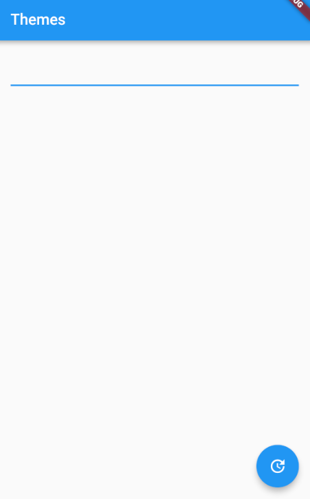
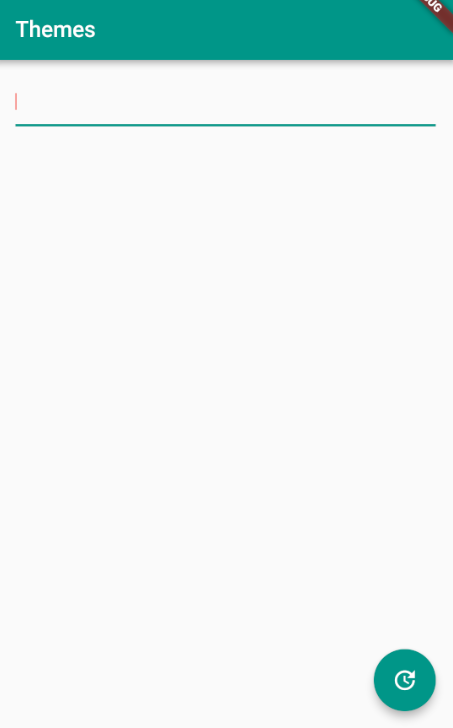

## Themes
In Android, We declare themes in XML and then assign it to our application using AndroidManifest.xml. However, in Flutter, we can declare themes in the top level widget. There are two kinds of widgets, `WidgetsApp` and `MaterialApp` we can use as a top level widget.

### WidgetsApp vs MaterialApp
Both widgets wrap a number of widgets that are commonly required for an application. It is recommended to use `MaterialApp` because it bulids upon a `WidgetsApp` by adding material-design specific functionality.

### How do we declare theme of our app?
Let's first take a look at `ThemeData` constructor.

ThemeData({Brightness brightness, MaterialColor primarySwatch, Color primaryColor, Brightness primaryColorBrightness,<br/> 
&ensp; &ensp; Color primaryColorLight, Color primaryColorDark, Color accentColor, Brightness accentColorBrightness, Color canvasColor,<br/>
&ensp; &ensp; Color scaffoldBackgroundColor, Color bottomAppBarColor, Color cardColor, Color dividerColor, Color highlightColor,<br/>
&ensp; &ensp; Color splashColor, InteractiveInkFeatureFactory splashFactory, Color selectedRowColor, Color unselectedWidgetColor,<br/>
&ensp; &ensp; Color disabledColor, Color buttonColor, ButtonThemeData buttonTheme, Color secondaryHeaderColor,<br/>
&ensp; &ensp; Color textSelectionColor, Color textSelectionHandleColor, Color backgroundColor, Color dialogBackgroundColor,<br/>
&ensp; &ensp; Color indicatorColor, Color hintColor, Color errorColor, String fontFamily, TextTheme textTheme,<br/>
&ensp; &ensp; TextTheme primaryTextTheme, TextTheme accentTextTheme, InputDecorationTheme inputDecorationTheme,<br/>
&ensp; &ensp; IconThemeData iconTheme, IconThemeData primaryIconTheme, IconThemeData accentIconTheme,<br/>
&ensp; &ensp; SliderThemeData sliderTheme, ChipThemeData chipTheme, TargetPlatform platform })

The most useful values to give are, in order of importance:
- The desired theme `brightness`.
- The primary color palette (the `primarySwatch`), chosen from one of the swatches defined by the material design spec. This should be one of the maps from the [Colors](https://docs.flutter.io/flutter/material/Colors-class.html) class that do not have "accent" in their name.
- The `accentColor`, sometimes called the secondary color, and, if the accent color is specified, its brightness(`accentColorBrightness), so thaht the right contrasting text color will be used over the accent color.

Let's define a `ThemeData` constructor. We are going to compare two constructors. First one is the default `ThemeData` constructor and the other is the constructor which passes `primarySwatch` and `textSelectionColor` values.

1) ```dart
   return new MaterialApp(
     theme: new ThemeData(),
   );   
   ```

2) ```dart
   return new MaterialApp(
     theme: new ThemeData(
       primarySwatch: Colors.teal,
       textSelectionColor: Colors.red,
     )
   );
   ```

| First | Second |
|-------|-------|
|||